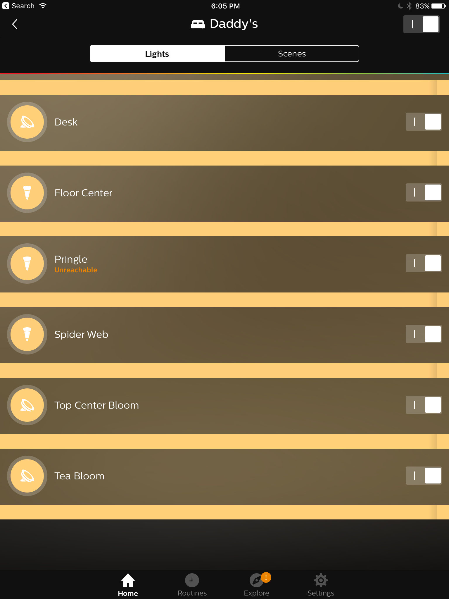
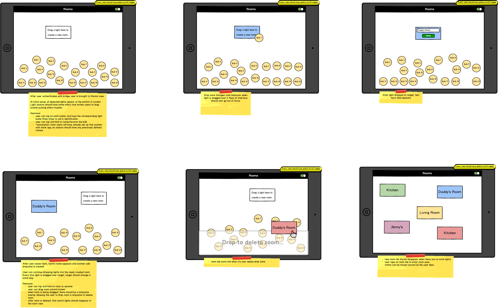
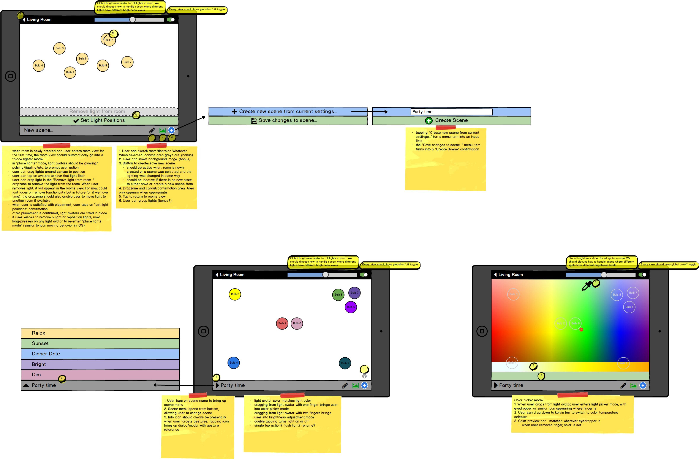

# Background and Overview

HueCanvas is an iPad application that enables users to control their lighting environments with the Philips Hue smart lighting system. This is achieved through an intuitive, gesture-based UI that is malleable and space oriented.

With the proliferation of mobile devices and internet-connected appliances (the “Internet of Things”, or IoT), people are increasingly able to interact with and effect changes in their physical environments in new and interesting ways. Because of the ubiquity and outsize role of lighting in people’s everyday lives, smart lighting control was an obvious early entrant into the IoT space, with Philips introducing their Hue lighting system in October 2012. With each Hue bulb capable of producing any of 16 million colors, the Hue system promised users unprecedented control over their lighting environments.

While the lighting products themselves are extremely capable, the software implementations to control them have been lacking. To-date, the majority of Hue apps rely on a list-based interface to control lights, with many actions and parameter settings nested deep within menus. This results in a tedious and frustrating user experience.



HueCanvas aims to solve these pain points by organizing the app interface around physical space so users know exactly which lights they are manipulating. User interaction is also focused on gestures, allowing users to really “paint” with their lights and effect changes with minimal input.

# Functionality and MVP
Hue Canvas is a mobile application that allows users to connect their Phillips hue bulbs to the app, arrange those bulbs in a way that's consistent with the way the bulbs sit in physical space, and adjust the brightness & hue both individually and in groups.

1. Sync app with Phillips hue bulbs
2. A production README
3. Demo site for recruiters
4. Rooms
  * Users can create, view (index & show), edit, & delete rooms
  * Adequate styling
  * Smooth, bug-free navigation
5. Scenes
  * Users can create, view (index & show), edit, & delete scenes for each room
  * Adequate styling
  * Smooth, bug-free navigation
6. Groups
  * Users can create, view (index & show), edit, & delete groups for lights
  * Adequate styling
  * Smooth, bug-free navigation

# Wireframes




# Sample State Shape
```javascript
{
  entities: {
    lights: {
      11: {
        id: 11,
        roomId: 2
        sceneId: 1
        state: {
            "on": true,
            "bri": 144,
            "hue": 13088,
            "sat": 212,
            "xy": [0.5128,0.4147],
            "ct": 467,
            "alert": "none",
            "effect": "none",
            "colormode": "xy",
            "reachable": true,
            "pos": [12, 14]
        },
        "type": "Extended color light",
        "name": "Hue Lamp 1",
        "modelid": "LCT001",
        "swversion": "66009461",
        "pointsymbol": {
            "1": "none",
            "2": "none",
            "3": "none",
            "4": "none",
            "5": "none",
            "6": "none",
            "7": "none",
            "8": "none"
        }
      }
    },
    rooms: {
      2: {
        id: 2,
        name: "Daddy's Room"
      }
    },
    scenes: {
    "4e1c6b20e-on-0": {
      "name": "Kathy on 1449133269486",
      "lights": ["2", "3"],
      "owner": "ffffffffe0341b1b376a2389376a2389",
      "recycle": true,
      "locked": false,
      "appdata": {},
      "picture": "",
      "lastupdated": "2015-12-03T08:57:13",
      "version": 1
      }
    },
    groups: {
      "1": {
          "name": "Group 1",
          "lights": [
              "1",
              "2"
          ],
          "type": "LightGroup",
          "action": {
              "on": true,
              "bri": 254,
              "hue": 10000,
              "sat": 254,
              "effect": "none",
              "xy": [
                  0.5,
                  0.5
              ],
              "ct": 250,
              "alert": "select",
              "colormode": "ct"
          }
      }
    },
    ui: {
    loading: true/false
    },
    errors: {
      Form: ["Form cannot be blank"],
    }
  }
}
```


# Technologies and Technical Challenges

This mobile iOS application will be implemented using React Native and the Philips Hue API.

Accessing the Philips Hue Light State
- The Philips Hue API allows for access to the Philips Hue lightbulbs JSON response, which includes the state of the bulb that stores information on the on/off state, hue, saturation, brightness, x and y coordinates, etc.
- The API also has storable access to a group state, in which to store lights that are grouped together to have the same attributes.

Manipulating the Light State
- The application will use the React Native framework to make requests to access the Philips Hue API responses
- The React Native Lights Components will create a user interface to access and store the changes to the lights’ states

Creating Scenes and Room Configuration
- The application will use Room and Rooms React Native components to create user functionality that allows for mapping of light configurations to match their physical space
- The Scenes components will allow for users to create and save specific light configurations and light environments for each room

Technical Challenges
- Learning how to use the Philips Hue API to access the light information as well as saving the changes to the state
- Using React Native and corresponding libraries for smooth and bug-free navigation and user interface

### Things Accomplished Over the Weekend
- Researched libraries and technologies to be used
- Documented improvements needed on the Philips Hue app
- Researched Philips Hue API and bridge storage features
- Completed React Native Tutorials
- Made basic API calls to the Hue bridge

### Group Members and Work Breakdown
Our group consists of four members: Rob Lim, Cory Kane, Pedro Preciado, and Alison Cheng.

Rob Lim’s primary responsibilities will be:
- Creating Lights components: Lights Index Container, Lights Index, Lights Index Item, Lights Form Container, Lights Form
- Color picker modal/functionality

Cory Kane’s primary responsibilities will be:
- Managing the overall file structure and store shape
- Creating the rooms form component and rooms form container
- Creating the primary navbar, the navbar container, including the global on/off toggle and brightness slider

Pedro Preciado’s primary responsibilities will be:
- Create components for Scenes
- Implement React Native Modal for forms
- Set up necessary Redux loop to deal with light state changes

Alison Cheng’s primary responsibilities will be:
- Creating the rooms index container and the rooms index component
- Creating the rooms index item component
- Creating the secondary navbar, the secondary navbar container, and the corresponding buttons for Creating/Editing/Saving Scenes in the Room View

### Week Plan

Day 1 (Monday)
- Begin Redux Loop for Scenes PEDRO
- Begin sending API calls to bridge and build Redux Loop for Lights ROB
- Begin Redux Loop and API calls for Rooms Index ALISON
- Create File Structure & Get Hello World Rendered on Screen Cory
- Begin Redux Loop for Rooms Form Cory

Day 2 (Tuesday)
- Begin creating forms for scenes and lights as modal ROB
- Add full screen color picker library PEDRO/ROB
- Build out Rooms Index Components ALISON
- Build out Form Components Cory

Day 3 (Wednesday)
- Test draggability and physical light changes for Lights and Scenes ROB
- Begin styling components and features (UX/UI) PEDRO
- Troubleshoot Rooms Index Component styling and UX ALISON
- Build out Nav Components Cory

Day 4 (Thursday)
- Begin creating Secondary NavBar for the Room view ALISON
- Polish Form & Nav Components Cory

Day 5 (Friday)
- Troubleshooting, styling and UX for Secondary NavBar ALISON

Day 6 (Saturday)
- Debugging and final user-interface styling touchups  ALL
- Start demo website and app emulator  ALL

Day 7 (Sunday)
- Production README ALL
- Finish up demo website and app emulator ALL

## Core Features/Functionality
- Node/map-based lighting control
  - Hue lights appear on canvas representing physical space
  - Bulb avatars can be dragged around the space
  - Using intelligent touch controls, from triggers on the avatars, users can adjust color and brightness
  - Tapping on avatar gets users access to other less used properties

- Actions/tools palette
  - Light properties would live with avatars, actions would live in an action palette, analogous to paint/drawing palettes in visual apps
  - E.g.
    - Save current light scene
    - Metronome (bonus)
    - Light sequencing (bonus)

### Technologies
- Philips Hue API
- React Native
- HTTP requests
- Expo
